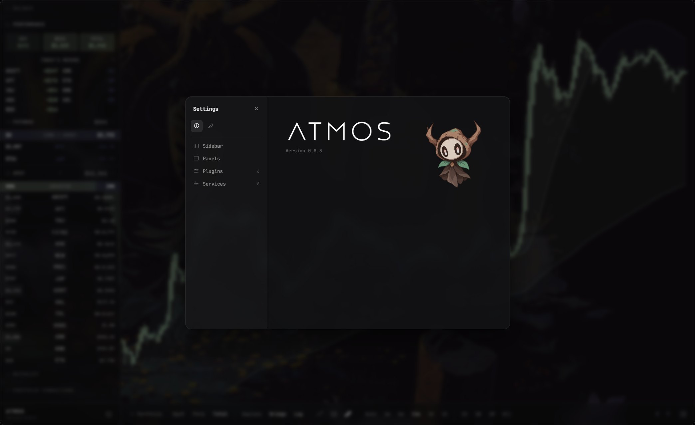

<p align="center">
  <picture>
    <source media="(prefers-color-scheme: dark)" srcset="docs/images/title.png">
    <source media="(prefers-color-scheme: light)" srcset="docs/images/blacktitle.png">
    
  </picture>
</p>

<p align="center">
  
</p>

# Atmos

**A modular desktop workspace where your tools live together.**

Atmos is a personal desktop environment for Windows, built around extensions.
Instead of opening dozens of separate applications, Atmos provides a unified
workspace where your tools, services and workflows can exist together.

Built with Electron, Atmos combines the flexibility of web technologies with
the feeling of a native desktop environment.

## Why Atmos?

Modern computing is fragmented.

Your music is in one app. Your messages are somewhere else. Your portfolio
is in a third. Your tools and services rarely understand one another.

Atmos explores a different approach:

**What if your applications were parts of one environment instead of isolated
windows?**

Atmos provides the foundation:

- A shared workspace
- A consistent design system
- Extensions instead of standalone apps
- Services that extensions can build upon
- A secure model for third-party additions

---

## Features

### Extensions

Atmos is built around extensions. They can add panels, sidebar widgets,
background tasks, shared services and custom workflows.

First-party extensions integrate deeply with Atmos, while third-party
extensions run through a permission-based SDK.

### A desktop built for extensions

Unlike traditional applications where every feature ships as one large
codebase, Atmos separates the environment from the experiences inside it:

```text
core/       Desktop runtime, panels, layouts, appearance, permissions and SDK
plugins/    User-facing extensions
services/   Shared capabilities
scripts/    Development, testing and release tooling
```

Core provides the environment. Extensions provide the experiences.

### The workspace

Atmos Core owns the shell, and extensions fill it.

- **Panels and layouts.** Show one panel full screen, split two side by side
  or stacked, run four in a grid, or float them as windows you can move,
  resize and layer. Dividers are draggable and every layout remembers its
  proportions. The mouse back button steps through recent panels; hold it
  for Task View.
- **A sidebar of widgets.** Widgets from any extension share one sidebar.
  Reorder them, resize them, collapse them, and choose whether each one
  shows everywhere or only beside a particular panel.
- **Appearance.** Themes, imported fonts, shared positive/negative/neutral
  colours, and per-panel blur and opacity. Atmos draws the frosted glass
  itself, so every extension gets the same material over your wallpaper.
- **Wallpaper.** Any image, with opacity, vignette and brightness controls,
  painted behind the whole workspace.
- **Background audio.** Each extension gets its own playback channel that
  keeps going through panel switches, layout changes and reloads, so
  sounds from different extensions never cut each other off.
- **Menus, notifications and shortcuts.** Right-click menus with toggles,
  sliders and pickers, system notifications, and keyboard shortcuts are all
  provided by Atmos, so extensions look and behave like part of one app.
- **Persistence.** Settings, layouts and each extension's state survive
  restarts, and your data is kept when you uninstall.

---

## Security model

Extensions should be powerful without requiring unlimited access. Atmos is
designed so that you can safely install things you did not write.

- **Sandboxed.** Every plugin runs in its own isolated frame and reaches
  Atmos only through the Atmos SDK. It can't see Atmos, other extensions
  or your files. Built-in extensions that keep secrets, such as the chat
  client's encryption keys, get a storage origin of their own too.
- **Declared permissions.** Each extension lists what it needs (network
  hosts, browser permissions, other extensions it talks to) and Atmos
  enforces that list. Settings shows it in plain language.
- **Approval.** An extension you add yourself doesn't run until you approve
  it, and if its files change afterwards, Atmos asks again.
- **Integrity.** An installed Atmos checks its bundled extensions at startup
  and refuses to load any whose files have been changed.
- **Built-in services.** Extensions share capabilities from Atmos (audio,
  wallpaper, location, media tags) rather than each reimplementing them.

---

## Included extensions

### Audio Player

A complete local music experience inside Atmos.

Features:

- Local music libraries and album browsing
- Queue management and persistent playback
- Metadata handling
- A waveform seek bar
- Now Playing, Queue and Library sidebar widgets
- Global play and pause controls

### Matrix Chat

A secure chat experience built directly into the workspace using
[Matrix](https://matrix.org), the open, federated messaging protocol.

- **Sign in or create an account** on your homeserver's own page, in your
  browser (matrix.org and any server using the Matrix Authentication
  Service), or with a password on other servers. The (i) on the sign-in
  screen explains what a Matrix account is.
- **End-to-end encrypted.** Private rooms and direct messages are
  encrypted. New accounts set up secure messaging with a recovery key;
  a new sign-in confirms it's you with that key or another device, and
  message history comes back from the encrypted key backup.
- **Knows who sent what.** A message from a device its owner never
  verified, a deleted device, or sent unencrypted in an encrypted room says
  so, and you're told when someone's encryption identity changes.
- **Your keys stay yours.** Sign-in tokens and encryption keys are stored
  encrypted with Windows' own secure storage, and deleted when you sign out.
- **Rooms, spaces and DMs** in a sidebar widget, with replies, edits,
  reactions, read receipts, images and files, and several accounts at once.
- **`rev/` commands** in the message bar: `rev/go`, `rev/join`, `rev/dm`,
  `rev/create-room`, `rev/create-space`, `rev/invite`, `rev/leave` and
  `rev/notifications`.

### Finance

Your portfolio and live markets inside the workspace, read from a portfolio
server you run yourself.

- **One balance across wallets and exchanges:** Solana (with Jupiter staking
  and locks), Hyperliquid (Spot, Perps and Earn), Arbitrum, BSC, Aptos,
  Cardano, Injective, Binance Spot, and Monero entered by hand.
- **Portfolio chart** with full history, scope filters to leave out a source,
  a holding or a group such as Perps, and a cash/invested breakdown.
- **Balance, Performance, Spot, Futures, Allocation and Connections widgets**
  in the sidebar, and a private mode that hides your balances.
- **Markets chart and watchlist** with live trades and candles from Binance,
  Bybit, Kraken and Coinbase. If an exchange is blocked where you are, the
  chart carries on with the others.
- **Your own server.** The portfolio server
  ([`plugins/finance/backend`](plugins/finance/backend)) collects every
  minute on a small VPS or a home server, with systemd or Docker, reachable
  over Tailscale or HTTPS. It uses only Python's standard library. Setting
  one up takes about 20 minutes:
  [SELF_HOSTING.md](plugins/finance/backend/SELF_HOSTING.md). Paid hosting
  is coming.
- **Pair with a code.** The server prints a pairing code; paste it into
  Portfolio Connections. The token is sealed in Windows' secure storage and
  never reaches the interface.
- **Read-only by design.** Finance never moves funds or places orders.
  Balances are estimates from third-party prices, nothing shown is financial
  advice, and the server should only ever get read-only API keys.

---

## Architecture

Atmos is built around three layers.

### Core

The runtime that powers Atmos. It manages windows, panels, layouts,
appearance, the sidebar, notifications, permissions and the extension
lifecycle.

### Plugins

User experiences built on top of Atmos. Plugins can provide interfaces,
widgets, background processes and custom functionality.

### Services

Reusable capabilities shared between extensions, including audio, wallpaper,
location, media metadata, full-screen viewing, charting, currency conversion
and live market data.

---

## Installation

Download `Atmos Setup <version>.exe` from the
[Releases](../../releases) page and run it. Atmos keeps your settings in
`%APPDATA%\atmos`; uninstalling leaves them.

## Development

Requirements:

- Node.js
- npm
- Windows for packaged builds
- Python 3.10+ only to run or test Finance's portfolio server

Install dependencies and run Atmos:

```bash
npm install
npm start
```

Build the Windows installer:

```bash
npm run build
```

Create a portable build:

```bash
npm run build:portable
```

### Build an extension

Put a folder in `%APPDATA%\atmos\plugins\<id>\` (or `services\<id>\`) with
an `extension.json` declaring its permissions, write its panel, widgets or
background work against the Atmos SDK, and restart Atmos. It appears in
Settings waiting for your approval. The smallest working example is
`scripts/e2e/fixtures/plugins/hello-frame`; the full API is in
[ATMOS_CORE_INTEGRATION.md](ATMOS_CORE_INTEGRATION.md) (§ 18 security,
§ 19 the Atmos SDK).

### Repository layout

```text
Atmos/
├── core/        # The runtime: window, panels, sidebar, settings, the extension host and SDK
├── plugins/     # User-facing extensions (audio-player, finance, matrix-chat)
├── services/    # Capabilities extensions call into (audio, charting, currency, fullscreen-viewer,
│                #   location, market-data, media-metadata, wallpaper)
├── scripts/     # Tests, permission audit, build hook, end-to-end checks
├── release.json # What an installer bundles
└── ATMOS_CORE_INTEGRATION.md   # The extension API
```

### Tests

| Command | What it does |
|---|---|
| `npm run test:core` | Core tests |
| `npm run test:services` | Service contract tests |
| `npm run test:permissions` | Checks each bundled extension's code against its declared permissions |
| `cd plugins/audio-player && node --test tests/*.test.cjs` | Audio Player tests |
| `cd plugins/matrix-chat && npm test` | Matrix Chat tests (`npm run check:browser` adds the message-sanitizer attack checks in a browser) |
| `npm run test:finance` | Finance and Markets tests |
| `cd plugins/finance/backend && python -m unittest` | Portfolio server tests |
| `node --test services/market-data/tests/*.test.cjs` | Market Data tests |
| `node scripts/e2e/<name>.cjs` | End-to-end checks in a throwaway profile (Linux/macOS/WSL; see `scripts/e2e/README.md`) |

---

## Project status

Atmos is actively evolving. The current focus is:

- Strengthening the extension architecture
- Expanding the SDK
- Improving security boundaries
- Building more first-party extensions
- Hosted portfolio servers for Finance, and a way for anyone to add a
  Finance connector in one file
- Preparing the foundation for a wider extension ecosystem

---

## Philosophy

Atmos is not trying to replace every application.

It is exploring a different question:

**What happens when applications stop being isolated tools and become parts of
a shared environment?**

---

## Community

Follow Atmos development on [X](https://x.com/atmosdesktop).

### Official token

Atmos has an official Rev community token. This listing is included to help
users identify the authentic token and avoid impersonators.

- Contract address: `5dw5MXrnW4wbqerxhUr4jAg92BeRjnux7Nf5RKHhpump`
- [View the official listing](https://pump.fun/coin/5dw5MXrnW4wbqerxhUr4jAg92BeRjnux7Nf5RKHhpump)

The token is not required to download, use or contribute to Atmos.

## License

Atmos is licensed under the [Apache License, Version 2.0](LICENSE).
Copyright 2026 hashy; see [NOTICE](NOTICE).
