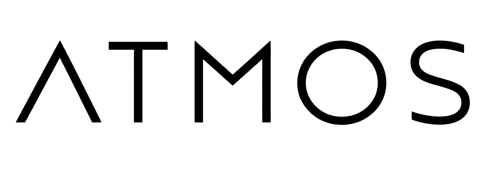
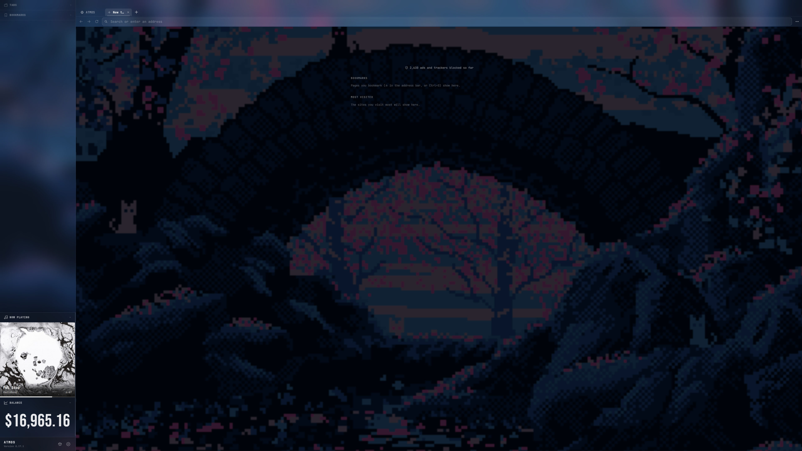

<p align="center">
  <picture>
    <source media="(prefers-color-scheme: dark)" srcset="docs/images/highres-white-title.png">
    <source media="(prefers-color-scheme: light)" srcset="docs/images/highres-black-title.png">
    
  </picture>
</p>

<p align="center">
  
</p>

# Atmos

**A browser built around you.**

Atmos is a browser and a workspace for Windows: browse, listen, chat and
follow your markets side by side, in one window you can extend. Its browser
blocks ads and trackers from the start and keeps every site in a sandbox of
its own. Its extensions don't reach into your pages. They build the place
around them instead: panels beside your pages, widgets in the sidebar, and
services other extensions can use, all written in plain web technologies.

## Why Atmos?

Most of what we do happens in a browser, yet a browser is a box of tabs,
and its extensions mostly reach into the pages inside it.

Your music is in one app. Your messages are somewhere else. Your portfolio
is in a third. None of them sits beside the page you're reading.

Atmos turns that around:

**The browser is the centre, and everything else you use lives beside it,
as extensions anyone can build.**

- A browser that's private by default
- A workspace around it: panels side by side, a sidebar of widgets, one look
- Extensions instead of standalone apps, on an SDK anyone can use
- Services that extensions can build upon
- A secure model for pages and extensions you didn't write

---

## Atmos Browser

Built in: Atmos opens on it.

- **Ads and trackers blocked,** like Brave's shields: uBlock Origin's
  lists, EasyList and EasyPrivacy, on from the start. A shield in the
  address bar counts what was blocked and turns blocking off for a site
  that needs it.
- **Tabs, bookmarks and history**, in the panel and in Tabs and Bookmarks
  widgets in the sidebar. An address bar that searches or goes to an
  address, with your search engine of choice.
- **Beside everything else.** Tile a page next to another panel or float
  it in a window, and links from Atmos and its extensions open in a new
  tab.
- **Private tabs** that keep nothing once the last one closes.
- **Downloads, find in page, zoom per site, print**, and the shortcuts you
  know from other browsers.
- **Light on memory:** tabs you haven't used for a while are put away and
  load again when you go back to them; restored tabs load only when opened.
- **Careful by default:** sites ask before using the camera, microphone,
  location or notifications, and the answer is remembered per site; pop-ups
  and repeated downloads need a click; no way past a certificate warning,
  and no certificate from your computer sent to a site; only documents and
  media are opened from the downloads list. It has no saved passwords or
  Safe Browsing yet.

## Extend it

This is what sets Atmos apart from other browsers: its extensions don't
reach into your pages, they add to the workspace around them.

- **Panels** beside your pages: full screen, side by side, in a grid of
  four, or floating in windows you move, resize and layer.
- **Sidebar widgets** that show beside any panel, the browser included.
- **Background work** that lasts the whole session: a player, a socket, a
  poller.
- **Services and libraries** for other extensions to build on: charts,
  currency, market data, media tags.
- **One SDK for everyone.** Official or not, every extension runs in
  sandboxed frames and reaches Atmos only through the same
  permission-based SDK, in plain HTML, CSS and JavaScript. `npm run
  new:extension` starts one from a template, with tests and typings; the
  SDK is MIT, so yours can use any licence (see
  [Build an extension](#build-an-extension)).

### The workspace

Atmos Core owns the shell, and extensions fill it.

- **Panels and layouts.** Show one panel full screen, split two side by side
  or stacked, run four in a grid, or float them as windows you can move,
  resize and layer. Dividers are draggable and every layout remembers its
  proportions. The mouse back button steps through recent panels; hold it
  for Task View.
- **A sidebar of widgets.** Widgets from any extension share one sidebar.
  Reorder them, resize them, collapse them, and choose whether each one
  shows everywhere or only beside a particular panel.
- **Appearance.** Themes, imported fonts, shared positive/negative/neutral
  colours, and per-panel blur and opacity. Atmos draws the frosted glass
  itself, so every extension gets the same material over your wallpaper.
- **Wallpaper.** Any image, with opacity, vignette and brightness controls,
  painted behind the whole workspace.
- **Background audio.** Each extension gets its own playback channel that
  keeps going through panel switches, layout changes and reloads, so
  sounds from different extensions never cut each other off.
- **Menus, notifications and shortcuts.** Right-click menus with toggles,
  sliders and pickers, system notifications, and keyboard shortcuts are all
  provided by Atmos, so extensions look and behave like part of one app.
- **Persistence.** Settings, layouts and each extension's state survive
  restarts, and your data is kept when you uninstall.

---

## Security model

A browser shows you pages you didn't write, and Atmos runs extensions you
didn't write. Neither gets more than it needs.

- **Web pages kept apart.** Atmos Browser's pages are sandboxed, in a
  browsing session of their own, where Atmos, its extensions and your
  files are out of reach, and Atmos itself, not the browser's interface,
  decides what a page may load and do. Camera, microphone, location,
  notifications and reading the clipboard stay off unless you allow a site.
- **Sandboxed extensions.** Extensions run in sandboxed frames and reach
  Atmos only through the Atmos SDK. A community extension can't see Atmos,
  other extensions or your files, and can't run code outside its frames.
  Official extensions can also run main-process code, but only get the
  APIs they declare.
- **Storage of its own.** Each extension's data (its settings and whatever
  it stores in the browser) is kept apart from every other extension's, so
  none can read or overwrite another's. (Official extensions from before
  Atmos 0.12 share one store until they are updated.)
- **Declared permissions.** Each extension lists what it needs (network
  hosts, browser permissions, other extensions it talks to) and Atmos
  enforces that list. Settings shows it in plain language.
- **Approval.** An extension you add yourself doesn't run until you approve
  it, and if its files change afterwards, Atmos asks again.
- **Shared on purpose.** An extension reaches another's features only where
  that extension has chosen to share them, and Atmos checks every such IPC
  call again in its main process. Community extensions get only what is
  shared with them explicitly; Media Metadata and Market Data share their
  file and network access with official extensions only.
- **Signed packages.** Official extensions are signed packages. Atmos
  checks every file against the signature when it starts and refuses to
  load one that has been changed.
- **A locked-down core.** The Atmos page, the window's own document, runs
  only Atmos's own code and never navigates away from Atmos: its
  Content-Security-Policy refuses injected scripts, it is sandboxed, and
  developer tools are off in installed copies (unless started with
  `--devtools`).

---

## Official extensions

Atmos Browser is built in. These are offered on Atmos's first start; each
is downloaded and installed on its own, and can be removed or updated on
Settings → Extensions.

### Finance

Your portfolio and live markets inside the workspace, read from a portfolio
server you run yourself.

- **One balance across wallets and exchanges:** Solana (with Jupiter staking
  and locks), Hyperliquid (Spot, Perps and Earn), Arbitrum, BSC, Aptos,
  Cardano, Injective, Binance Spot, and Monero entered by hand.
- **Portfolio chart** with full history, scope filters to leave out a source,
  a holding or a group such as Perps, and a cash/invested breakdown.
- **Balance, Performance, Spot, Futures, Allocation and Connections widgets**
  in the sidebar, and a private mode that hides your balances.
- **Markets chart and watchlist** with live trades and candles from Binance,
  Bybit, Kraken and Coinbase. If an exchange is blocked where you are, the
  chart carries on with the others.
- **Your own server.** The portfolio server
  ([`plugins/finance/backend`](plugins/finance/backend)) collects every
  minute on a small VPS or a home server, with systemd or Docker, reachable
  over Tailscale or HTTPS. It uses only Python's standard library. Setting
  one up takes about 20 minutes:
  [SELF_HOSTING.md](plugins/finance/backend/SELF_HOSTING.md). Paid hosting
  is coming.
- **Pair with a code.** The server prints a pairing code; paste it into
  Portfolio Connections. The token is sealed in Windows' secure storage and
  never reaches the interface.
- **Read-only by design.** Finance never moves funds or places orders.
  Balances are estimates from third-party prices, nothing shown is financial
  advice, and the server should only ever get read-only API keys.

### Audio Player

A complete local music experience inside Atmos.

Features:

- Local music libraries and album browsing
- Queue management and persistent playback
- Metadata handling
- A waveform seek bar
- Now Playing, Queue and Library sidebar widgets
- Global play and pause controls

### Matrix Chat

A secure chat experience built directly into the workspace using
[Matrix](https://matrix.org), the open, federated messaging protocol.

- **Sign in or create an account** on your homeserver's own page, in your
  browser (matrix.org and any server using the Matrix Authentication
  Service), or with a password on other servers. The (i) on the sign-in
  screen explains what a Matrix account is.
- **End-to-end encrypted.** Private rooms and direct messages are
  encrypted. New accounts set up secure messaging with a recovery key;
  a new sign-in confirms it's you with that key or another device, and
  message history comes back from the encrypted key backup.
- **Knows who sent what.** A message from a device its owner never
  verified, a deleted device, or sent unencrypted in an encrypted room says
  so, and you're told when someone's encryption identity changes.
- **Your keys stay yours.** Sign-in tokens and encryption keys are stored
  encrypted with Windows' own secure storage, and deleted when you sign out.
- **Rooms, spaces and DMs** in a sidebar widget, with replies, edits,
  reactions, read receipts, images and files, and several accounts at once.
- **`rev/` commands** in the message bar: `rev/go`, `rev/join`, `rev/dm`,
  `rev/create-room`, `rev/create-space`, `rev/invite`, `rev/leave` and
  `rev/notifications`.

---

## Architecture

Atmos is built around three layers.

### Core

The runtime that powers Atmos. It manages windows, panels, layouts,
appearance, the sidebar, notifications, permissions and the extension
lifecycle, and it hosts Atmos Browser's pages and decides what they may do.

### Plugins

User experiences built on top of Atmos. Plugins can provide interfaces,
widgets, background processes and custom functionality. Atmos Browser is a
plugin too, the one Atmos comes with: Core holds its pages and their rules,
and the plugin is its interface and memory.

### Services

Reusable capabilities shared between extensions, so each one doesn't
reimplement them. Audio, wallpaper and location are part of Core itself;
the others are extensions like any plugin: media metadata, full-screen
viewing, charting, currency conversion and live market data.

Every plugin runs in sandboxed frames and talks to Core through the Atmos
SDK. A service is a library that runs inside the frames of the extensions
that use it; some also have main-process code.

---

## Installation

Download `Atmos.Setup.<version>.exe` from the
[Releases](../../releases) page and run it. It comes with Atmos Browser;
the other extensions are offered on the first start. Atmos keeps your
settings in `%APPDATA%\atmos`; uninstalling leaves them.

Atmos updates itself, as Chrome does: when a newer Atmos is out, it
downloads the installer in the background, checks it against the release's
signed index, and installs it when you quit Atmos (or at once, from
"Restart to update" in Settings → Extensions; an update left waiting two
days gets a reminder). Your settings and extensions stay. "Update Atmos automatically" there turns it off; Atmos
then only says a new version is available. Atmos 0.18 and older say so
with a link to this page: run the new installer over the old one.
Installed for every user, Atmos installs an update only from "Restart to
update", since Windows asks first. The portable build
doesn't update itself.

## Development

Requirements:

- Node.js
- npm
- Windows for packaged builds
- Python 3.10+ only to run or test Finance's portfolio server

Install dependencies and run Atmos:

```bash
npm install
npm start
```

Build the Windows installer:

```bash
npm run build
```

An installer carries Core, which includes the system services (Audio,
Location, Wallpaper), and Atmos Browser, the one extension built in
(`core/built-in-extensions.json`): it can be switched off, not removed,
and a newer signed package still updates it. Every other extension is
downloaded from the official source, the latest release of
[atmos-desktop](https://github.com/samsaraserenade/atmos-desktop)
(`core/extension-sources.json`): Atmos offers them on its first start
("Choose your extensions"; offline it says so and offers to try again) and
installs them like any other, so each can be removed or updated on
Settings → Extensions. An Atmos that bundled them before downloads what it
had in the background after the upgrade and asks for a restart. A personal
build (`npm run build:personal`) also carries its other extensions as signed
packages ("Comes with Atmos"), so its first run and upgrades work offline;
building it signs them, so it needs the package key: set `ATMOS_SIGNING_KEY`
to the key file (the passphrase is asked for, or `ATMOS_SIGNING_PASSPHRASE`).
`npm start` from the repo still runs every extension straight from
`plugins/` and `services/`.

Create a portable build:

```bash
npm run build:portable
```

### Build an extension

In a clone of this repository:

```bash
npm install
npm run new:extension -- ../my-widget
```

That makes an extension from the template: a panel, a sidebar widget, tests
against a fake Atmos, and typings for your editor. Start Atmos with
`--dev-extension=<folder>` to run it from where you write it: it reloads as
you save, with no approval prompts. Atmos from source runs on Linux and
macOS as well as Windows (as root on Linux, add `--no-sandbox`). To share it,
copy the folder into `%APPDATA%\atmos\plugins\` on another computer: the
footer's Extensions button says it's waiting for approval, and it loads as
soon as it's approved. The guide is
[ATMOS_CORE_INTEGRATION.md](ATMOS_CORE_INTEGRATION.md): § 1 to get going,
§ 4 the Atmos SDK, § 5 the shared libraries, § 7 security.

### Repository layout

```text
Atmos/
├── core/        # The runtime: window, panels, sidebar, settings, the extension host and SDK,
│                #   web pages for Atmos Browser, and the system services (core/system:
│                #   audio, location, wallpaper)
├── plugins/     # User-facing extensions (browser, built in; audio-player, finance, matrix-chat)
├── services/    # Capabilities extensions call into (charting, currency, fullscreen-viewer,
│                #   market-data, media-metadata)
├── scripts/     # Tests, permission audit, build hook, end-to-end checks
├── templates/   # The extension template (npm run new:extension)
├── .github/     # CI: npm run test:all on every push
├── release.json # What is released: exported to the public repo and packed as packages
└── ATMOS_CORE_INTEGRATION.md   # The extension API
```

### Tests

| Command | What it does |
|---|---|
| `npm run test:all` | Every test below except the end-to-end checks (Matrix Chat's after `npm ci` in its folder) |
| `npm run test:core` | Core tests |
| `npm run test:services` | Service contract tests |
| `npm run test:permissions` | Checks each bundled extension's code against its declared permissions |
| `npm run test:build` | The build hook (`scripts/after-pack.cjs`) |
| `npm run test:sdk` | The extension template: it is made, its own tests pass, and the typings cover the SDK |
| `cd plugins/audio-player && node --test tests/*.test.cjs` | Audio Player tests |
| `node --test plugins/browser/tests/*.test.mjs` | Atmos Browser tests (the address bar, tabs, history and bookmarks, the engine against a fake Atmos) |
| `cd plugins/matrix-chat && npm ci && npm test` | Matrix Chat tests (`npm run check:browser` adds the message-sanitizer attack checks in a browser; it uses Edge, so set `MATRIX_TEST_BROWSER` elsewhere) |
| `npm run test:finance` | Finance and Markets tests |
| `cd plugins/finance/backend && python -m unittest` | Portfolio server tests |
| `node --experimental-vm-modules --test services/<id>/tests/*.test.cjs` | A service's own tests (Charting, Market Data, Media Metadata; Charting needs the flag) |
| `node scripts/e2e/<name>.cjs` | End-to-end checks in a throwaway profile (Linux/macOS/WSL; see `scripts/e2e/README.md`) |

---

## Project status

Atmos is actively evolving. The current focus is:

- Making Atmos Browser one you can live in: updates that keep up with
  Chromium's security fixes, phishing and malware warnings, saved
  passwords, and bringing your bookmarks over from other browsers
- Letting extensions work with the pages you browse, safely
- Expanding the SDK, and the foundation for a wider extension ecosystem
- Hosted portfolio servers for Finance, and a way for anyone to add a
  Finance connector in one file

---

## Philosophy

Atmos is not trying to replace every application.

It is exploring a different question:

**What happens when your browser stops being a box of tabs and becomes the
centre of a workspace you can extend?**

---

## Community

Follow Atmos development on [X](https://x.com/atmosdesktop).

### Official token

Atmos has an official Rev community token. This listing is included to help
users identify the authentic token and avoid impersonators.

- Contract address: `5dw5MXrnW4wbqerxhUr4jAg92BeRjnux7Nf5RKHhpump`
- [View the official listing](https://pump.fun/coin/5dw5MXrnW4wbqerxhUr4jAg92BeRjnux7Nf5RKHhpump)

The token is not required to download, use or contribute to Atmos.

## License

Atmos is free software under the [GNU General Public License, version 3](LICENSE),
with the [Atmos Extension Exception](LICENSE-EXCEPTION.md). Copyright 2026
hashy; see [NOTICE](NOTICE).

- **Atmos itself stays open.** Anyone who distributes Atmos, or a modified
  version of it, has to share the source under the same licence.
- **Extensions are yours to license.** A plugin or service that works with
  Atmos only through the Atmos SDK and extension interface can use any
  licence, including a paid, closed one. The SDK (`core/js/sdk/`) is MIT, so
  you can bundle it freely.
- **The Finance portfolio server** (`plugins/finance/backend/`) is under the
  [GNU Affero GPL, version 3](plugins/finance/backend/LICENSE): if you run a
  modified copy for other people, you must offer them its source.

Releases up to 0.10.0 were published under the Apache License 2.0 and stay
available under it.
